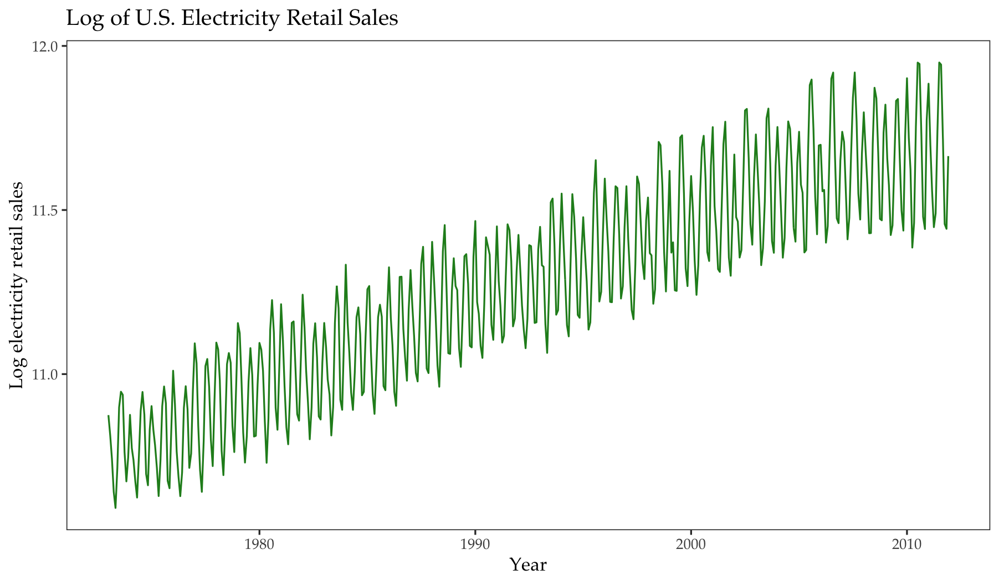

# Economic and Financial Time-Series Forecasting

**How well do standard ARMA/ARIMA and GARCH models forecast U.S. electricity demand, WTI oil prices, and Disney return volatility on held-out samples?**



## Overview

This project fits course-standard time-series models to three series: monthly U.S. residential electricity sales, monthly WTI crude-oil prices, and daily Disney stock prices. Each series is split into a training sample and a holdout window. Model order is chosen by BIC. Unit-root tests are used for oil prices; ARCH/GARCH models are used for Disney returns.

The write-up in `reports/final-report.pdf` follows the original course question list. Treat it as a **private draft** until you confirm that posting a full answers-style PDF is acceptable.

## Key Findings

Figures and tables come from `R/02_analysis.R` and `outputs/`.

- **Electricity (1973M01–2011M12; 468 months).** A quadratic trend plus month effects is selected over a linear trend (BIC −447.27 vs −446.81). The cycle on those residuals is **ARMA(3,3)** (BIC **−1611.82**). Twelve-month 2011 forecasts are stored in `outputs/q1_forecasts_2011.csv`.
- **WTI (1986–2024; 466 months).** ADF tests fail to reject a unit root in levels and reject it in first differences. The BIC-selected model for changes is **ARMA(1,0)** / **ARIMA(1,1,0) with drift** (BIC **2521.32**). The 2023–2024 holdout has 22 months.
- **Disney (2007-01-03–2024-11-13; 4,498 daily observations).** Squared returns are serially correlated (AR(1) coefficient 0.190). Among ARCH(1), GARCH(1,1), AR(1)-ARCH(1), and AR(1)-GARCH(1,1), **GARCH(1,1)** has the lowest BIC (**−5.488**). Estimated persistence is **α₁ + β₁ = 0.982** (α₁ = 0.078, β₁ = 0.904). The fGarch fits report singular convergence (code 7); coefficients and volatilities are finite and are disclosed in the output tables.

## Data

Course CSVs in `data/`: electricity, WTI, and Disney. Combined span **1973–2024**. See [`data/README.md`](data/README.md).

## Methods

- **Electricity:** log transformation; linear vs quadratic trend (BIC); month dummies; ARMA(p,q) on residuals with p, q ≤ 3; 2011 holdout forecast with 95% intervals.
- **Oil:** ACF/PACF; manual Dickey–Fuller regressions and `aTSA::adf.test`; ARMA on differences and the equivalent ARIMA in levels; 2023–2024 holdout.
- **Disney:** log returns; histogram and moments; ACF of squared returns; AR(1) on squares; ARCH/GARCH comparison by BIC; conditional-volatility plot and October–November 2024 forecast.

## Reproducing the Analysis

From the repository root, with R 4.5+ and packages `ggplot2`, `dplyr`, `forecast`, `aTSA`, and `fGarch`:

```bash
Rscript R/run_all.R
```

Keep `data/elec.csv`, `data/wti_oil_price.csv`, and `data/disney_stock_price.csv` in place. `R/01_data_prep.R` checks dimensions; `R/02_analysis.R` estimates models and writes figures; `R/03_visualization.R` copies the README image.

## Repository Structure

```text
R/                 data checks, full forecasting script, hero-figure copy
data/              three course CSVs
figures/           README figure and additional charts
outputs/           BIC matrices, ADF tables, forecasts, GARCH coefficients
reports/           course write-up (answers format; confirm before public release)
sessionInfo.txt    R session from the original run
```

## Limitations

Holdout windows are short (12 months of electricity; 22 months of oil; a few weeks of Disney). BIC can prefer a model that still leaves residual correlation. GARCH estimates use the course default solver settings and report singular convergence. Results are forecasting exercises on these series, not structural models of energy markets or asset prices.

## Academic Context

Final project for **ECON 475** (Economic Forecasting), University of Illinois Urbana-Champaign, Summer 2026. The PDF is a complete question-by-question write-up, not a journal-style paper.

## Authors / Contributions

**Hexu Jin** — data preparation, model estimation, figures, and write-up.

## Contact

[jinhexu6@gmail.com](mailto:jinhexu6@gmail.com)
